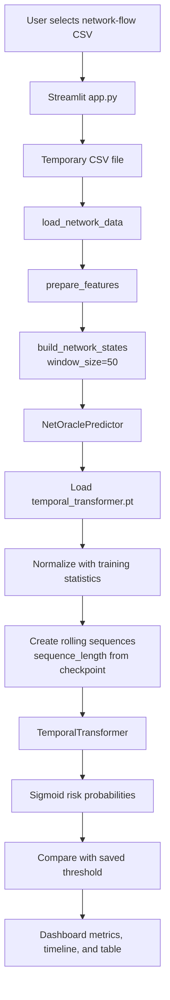

# NetOracle Architecture and Workflow

NetOracle is a Streamlit application for detecting suspicious behavior in network-flow CSV files. It converts individual flow records into fixed-size time-ordered summaries, evaluates rolling groups of those summaries with a trained temporal Transformer, and displays a risk timeline in the browser.

## 1. System Overview



The main runtime components are:

- `app.py`: user interface and orchestration of the upload-to-report flow.
- `preprocressing/load_data.py`: CSV loading, header handling, column cleanup, and invalid-value cleanup.
- `preprocressing/features.py`: maps supported input columns to a fixed eight-feature numeric representation.
- `preprocressing/state_builder.py`: aggregates flows into fixed-width network states and can create labelled temporal sequences.
- `inference/predict.py`: loads the trained artifact, validates input states, performs normalization and inference, and builds the report.
- `models/temporal_transformer.py`: sequence classifier that models relationships between consecutive network states.
- `saved_models/temporal_transformer.pt`: serialized model weights and the preprocessing/inference metadata required to use those weights.
- `training/train_world_model.py`: offline training and checkpoint-generation pipeline.
- `utils/mitre_mapper.py`: small stage-name lookup helper; it is not currently connected to the live Streamlit inference path.

## 2. User Upload and Application Lifecycle

1. The user opens the Streamlit dashboard with `streamlit run app.py`.
2. `st.file_uploader` accepts a CSV file.
3. The uploaded bytes are written to a uniquely named temporary file. This gives the pandas loader a normal filesystem path and avoids keeping a permanent copy of the user's upload.
4. The app invokes the processing stages in order:

   ```text
   uploaded CSV
       -> load_network_data
       -> prepare_features
       -> build_network_states(window_size=50)
       -> NetOraclePredictor.analyze
   ```

5. The temporary file is deleted in the `finally` block after processing, whether analysis succeeds or fails.
6. Errors are presented in the UI as follows:
   - missing model file: an error because the model must be trained or restored first;
   - unsupported or unusable CSV: a warning for expected `ValueError` cases;
   - other failures: a general error message.

## 3. Input Loading and Cleaning

`load_network_data` reads the CSV with pandas.

### Supported CSV shapes

- A headered CSV can use the normal column names directly.
- A headerless CSV with exactly 49 columns is interpreted using the `UNSW_NB15_COLUMNS` schema.
- Header detection checks for known names such as `srcip`, `sport`, `dstip`, `dsport`, `dur`, `sbytes`, and `label`.

After loading, the loader:

1. strips whitespace from column names;
2. replaces positive and negative infinity with missing values;
3. removes rows that are entirely empty;
4. resets the row index.

The loader does not filter attacks, sort records, or infer timestamps. The input row order is therefore the order used by later windowing and temporal analysis.

## 4. Feature Engineering

`prepare_features` produces a fixed-width numeric DataFrame with these eight features:

| Model feature | Accepted source examples |
| --- | --- |
| `bytes` | `Flow Bytes/s`, `Total Length of Fwd Packets`, `bytes`, `total bytes`, `sbytes`, `dbytes` |
| `flow_duration` | `Flow Duration`, `duration`, `flow duration`, `dur` |
| `packets` | `Total Fwd Packets`, `Total Backward Packets`, `packets`, `packet count`, `spkts`, `dpkts` |
| `destination_port` | `Destination Port`, `dst_port`, `destination port`, `dsport` |
| `syn_count` | `SYN Flag Count`, `syn_count`, `synack`, `syn` |
| `ack_count` | `ACK Flag Count`, `ack_count`, `ackdat`, `ack` |
| `avg_packet_size` | `Average Packet Size`, `Avg Packet Size`, `packet size`, `smeansz` |
| `iat_mean` | `Flow IAT Mean`, `iat_mean`, `IAT Mean`, `sintpkt` |

Matching is case-insensitive after trimming column names. For each feature, the first matching alias is used. If a feature is absent, its entire column is filled with `0.0`; this allows partially compatible flow formats to run while preserving the model's required width. Matched values are converted to numbers, invalid values become `0.0`, and the final frame is `float32`.

At least one supported source column must be present. Otherwise, the application stops with a validation error rather than sending an all-zero input to the model.

The optional `extract_labels` function recognizes `label`, `attack`, `is_attack`, or `malicious`. It converts numeric values greater than zero to attack labels. This function is used during training, not during normal user-upload inference.

## 5. Building Network States

The application calls `build_network_states(features, window_size=50)`. The feature rows are divided into consecutive, non-overlapping blocks of 50 flows:

```text
flows 0..49     -> state 0
flows 50..99    -> state 1
flows 100..149  -> state 2
```

Any incomplete final block is discarded. For every complete block, the state contains:

1. the mean of each of the eight features; and
2. the standard deviation of each of the eight features.

Each state therefore has 16 values in the order:

```text
[8 feature means, 8 feature standard deviations]
```

The result has shape `[number_of_complete_50_flow_windows, 16]` and is stored as `float32`. Aggregation reduces individual flow noise while retaining both the typical level and variability of each feature in the block.

The app displays the number of input flows and complete 50-flow windows. It does not display or use ground-truth labels during inference.

## 6. Model Artifact Loading

When `NetOraclePredictor` is created, it loads `saved_models/temporal_transformer.pt` on the CPU. The checkpoint contains:

- `model_state`: trained PyTorch weights;
- `state_dim`: expected state width, normally 16;
- `sequence_length`: number of consecutive states required by the model;
- `feature_names`: the eight feature names used to build the states;
- `normalization_mean` and `normalization_scale`: training-derived per-state-column statistics;
- `threshold`: the risk cutoff for the Normal/Suspicious decision;
- `model_config`: Transformer settings such as model width, attention heads, layers, and dropout.

The predictor reconstructs the same `TemporalTransformer`, loads its weights, and switches it to evaluation mode. Inference is CPU-compatible and runs under `torch.no_grad()`.

The checkpoint is important because the model cannot safely be used with only its weights. The sequence length, feature width, normalization values, and decision threshold must match the values used during training.

## 7. Rolling Temporal Inference

`analyze` first converts the states to a NumPy `float32` array and validates that:

- the input is two-dimensional; and
- its second dimension equals `len(feature_names) * 2` (eight means plus eight standard deviations).

It then checks that enough complete states exist for at least one model sequence. The states are transformed into overlapping rolling sequences of the checkpoint's configured length. If the checkpoint sequence length is 8, the sequence layout is:

```text
states 0..7  -> prediction for state 7
states 1..8  -> prediction for state 8
states 2..9  -> prediction for state 9
```

For every sequence, the predictor applies the saved normalization values:

$$x_{normalized} = \frac{x - mean}{scale}$$

The normalized array is converted to a PyTorch tensor and passed to the Transformer. The model returns one logit per sequence. A sigmoid converts each logit into a risk probability between 0 and 1.

## 8. Temporal Transformer Internals

`TemporalTransformer` expects input shaped `[batch, sequence, features]`.

1. `input_projection` maps each 16-value state into the Transformer model dimension, configured as 64 by default.
2. A learned positional embedding is added so the model can distinguish early and late states within a sequence. The implementation supports positions up to 512 states.
3. A stack of Transformer encoder layers uses multi-head self-attention to compare every state with the other states in the same rolling sequence. The saved default configuration uses four attention heads and two encoder layers.
4. The encoded representation of the final state in the sequence is selected. This makes the prediction correspond to the most recent state while still allowing the model to use the preceding temporal context.
5. Layer normalization and a linear classifier produce one scalar logit.

The predictor applies the sigmoid outside the model, so the model itself returns logits rather than probabilities.

## 9. Decision and Analysis Report

Each probability becomes a window result:

```text
{
  "window": <ending state index>,
  "risk": <probability>,
  "status": "Suspicious" if risk >= threshold else "Normal"
}
```

The overall report contains:

- `status`: `Suspicious` if at least one rolling sequence crosses the threshold, otherwise `Normal`;
- `risk`: the maximum risk across all analyzed sequences;
- `threshold`: the checkpoint's decision threshold;
- `windows_analyzed`: number of rolling sequences evaluated;
- `suspicious_windows`: count of sequences above the threshold;
- `suspicious_percentage`: suspicious sequence count divided by analyzed sequence count, expressed as a percentage;
- `windows`: the per-sequence timeline records.

This means the overall decision is intentionally sensitive: one suspicious sequence is enough to make the report `Suspicious`. The displayed maximum risk is not an average risk and is not a calibrated probability of the entire uploaded file being malicious.

## 10. Streamlit Analysis Output

The dashboard renders the report as:

- a success or error banner with the overall decision and maximum risk;
- four metrics for decision, maximum risk, analyzed windows, and suspicious-window percentage;
- a Plotly line chart of risk by ending network-window index;
- a horizontal line showing the saved decision threshold;
- a table containing each window's index, risk, and status.

The x-axis represents the index of the ending aggregated state, not an original timestamp. Because the pipeline does not currently parse or display `stime`/`ltime`, the chart is a sequence timeline rather than a wall-clock timeline.

## 11. Offline Training Workflow

The shipped model is produced by `training/train_world_model.py`:

1. Load `data/UNSW-NB15_4.csv` with the same loader used by the app.
2. Extract binary attack labels from a supported label column. Training requires both normal and attack rows.
3. Build the same eight numeric features.
4. Aggregate rows into non-overlapping states of 50 flows and assign each state the maximum attack label in its 50-flow block. A state is positive if any flow in that block is labelled an attack.
5. Build overlapping sequences of eight states. The target is the label of the final state in each sequence.
6. Split sequences chronologically: the first 80% is training data and the remaining data is validation data. This preserves order instead of randomly mixing future and past windows.
7. Calculate normalization mean and standard deviation from the training sequences only. Near-zero scales are replaced with `1.0` to avoid division by zero.
8. Train the Transformer with AdamW and weighted binary cross-entropy. The positive class weight compensates for attack/normal imbalance.
9. Evaluate validation probabilities and search thresholds from `0.20` through `0.80` for the best F1 score.
10. Save weights, preprocessing statistics, model configuration, sequence length, feature names, and threshold to `saved_models/temporal_transformer.pt`.

The same window size and feature construction must be preserved between training and inference. The training script currently uses the fixed constants `WINDOW_SIZE = 50` and `SEQUENCE_LENGTH = 8`; the inference code reads the sequence length from the checkpoint.

## 12. MITRE Stage Helper and Current Scope

`utils/mitre_mapper.py` maps integer IDs to labels such as `Reconnaissance`, `Initial Access`, `Lateral Movement`, `Command & Control`, and `Exfiltration`. There is no stage output in the checkpoint, model output, predictor report, or Streamlit UI, and no current call from `app.py` or `inference/predict.py` to `get_stage_name`.

Therefore, the current product performs binary suspiciousness detection and risk visualization. It does not yet infer a MITRE ATT&CK tactic, technique, or attack stage from the uploaded traffic. Adding that capability would require a labelled stage target, a mapping from model outputs or detected features to stages, and a new report/UI field.

## 13. Operational Constraints and Failure Cases

- The model file must exist before the dashboard can analyze a file.
- At least one supported feature source column must be present.
- At least 50 flows are needed to create one complete state, and at least as many states as the checkpoint sequence length are needed to produce one prediction. With the default training configuration, that means at least 8 complete states, or 400 flows.
- Incomplete trailing flow blocks are ignored.
- Input rows remain in file order; callers should provide traffic in the intended chronological order.
- Missing feature columns are zero-filled, which keeps the tensor shape valid but can reduce prediction quality when important measurements are absent.
- The uploaded file is deleted after the request finishes, but the generated report is only held in the active Streamlit session.
- The implementation loads the model on CPU, so it does not require a GPU for dashboard inference.

## 14. Running the System

Install dependencies:

```bash
python -m venv .venv
source .venv/bin/activate
pip install -r requirements.txt
```

Regenerate the model artifact when training data or model code changes:

```bash
python training/train_world_model.py
```

Start the dashboard:

```bash
streamlit run app.py
```

Then upload a headered or headerless compatible network-flow CSV. The dashboard will process the upload through the runtime path above and show the binary risk analysis.